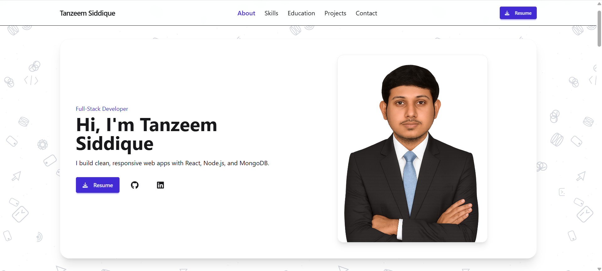
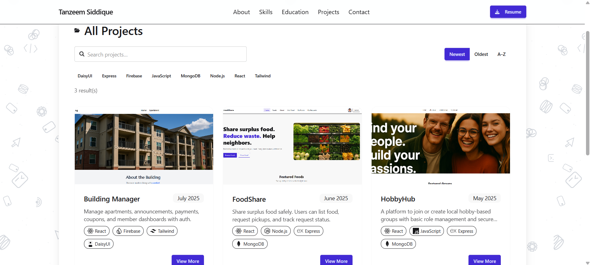

# Tanzeem Siddique — Portfolio (React + Vite + Tailwind/DaisyUI)

## Overview

A clean, responsive developer portfolio built with **React (Vite)**, **Tailwind CSS**, **DaisyUI**, **Framer Motion**, **React Icons**, **React Toastify**, and **react-router**.  
Sections: **Hero, About, Skills, Education, Projects, Contact** — all aligned to a shared container with smooth scroll-in animations.

---

## Live Site

**Frontend:** [https://food-sharing-app-client-side.netlify.app](https://food-sharing-app-client-side.netlify.app)

---


## Features

- **Responsive Navbar**  
  Full-width background, centered links, and a Resume button that **downloads** a file if configured or shows a **Toast** if not ready.

- **Hero**  
  Designation, greeting, tagline, GitHub/LinkedIn links, and a **large rectangular framed photo** (hi-res supported via `photo2x`).

- **About**  
  Intro, programming journey, what you enjoy, hobbies, and personality traits — content driven from data.

- **Skills**  
  Category **tabs** + icon **chips** (tooltips).  
  **Autoplay micro-demos** with a progress bar (beginner-friendly snippets), **pauses when section is off-screen**, and manual Next/Copy.

- **Education**  
  Example entry for **Fort Hays State University (2023 — Present)** with university link.

- **Projects**  
  Cards with cover, stack chips, and “View More / Details”.  
  Details include stack, description, **release month + year**, live link, GitHub (client), challenges, and improvements.  
  (Three sample projects: HobbyHub — May 2025, FoodShare — June 2025, Building Manager — July 2025.)

- **Contact**  
  Email / Phone / WhatsApp with action buttons and **copy to clipboard**.

- **Footer**  
  Brand, **Quick Links** (black → blue on hover, go to **home sections** including Projects), Contact, and Back-to-Top.

- **Layout consistency**  
  All sections use a shared `PageContainer` so the navbar/footer/sections align at every zoom level — no Tailwind config required.

---

## Tech Stack

- **React** (Vite)
- **Tailwind CSS** + **DaisyUI**
- **Framer Motion**
- **react-router** 
- **React Icons**
- **React Toastify** 

---


## Screenshots

### Home



### Projects



---

## Installation

1. Clone the repository
2. Run `npm install`
3. Run the app locally:

```
npm run dev
```

---

## Developed by

Tanzeem Siddique
